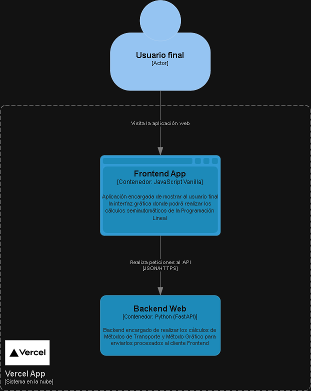

## 🚀 Despliegue y Arquitectura Nivel 2 de C4

### 🌐 Demo de la aplicación desplegado
El proyecto se encuentra desplegado y funcional en la plataforma **Vercel**:
* **URL de la Aplicación:** [https://proyecto-final-investigacion-operac.vercel.app](https://proyecto-final-investigacion-operac.vercel.app)

---

### 🧩 Diagrama de Contenedores (C4 - Nivel 2)
A continuación se presenta una pequeña arquitectura del sistema, ilustrando la separación entre el cliente (Frontend estático) y el servidor (Backend FastAPI Serverless) y cómo interactúan entre sí dentro de Vercel:




# Proyecto Final - Investigación de Operaciones

## Descripción del Proyecto

Este proyecto es una aplicación web desarrollada para resolver problemas clásicos de **Programación Lineal** en el área de la **Investigación de Operaciones** y la **Optimización**.

Este proyecto implementa lo siguiente:

* Método gráfico para hallar el punto óptimo *(sin análisis de sensibilidad)*.
* Métodos de transporte:

  * Costo Mínimo.
  * Esquina Noroeste.
  * Aproximación de Voguel.

La aplicación permite al usuario elegir la opción que desea resolver mediante la interfaz web. Una vez seleccionado el método, se ingresan los datos correspondientes y, de forma interna, la información es enviada a un API encargada de realizar los cálculos y devolver los resultados para su visualización.

---

# Tecnologías Utilizadas

## Frontend

* HTML
* CSS
* JavaScript
* Tailwind CSS *(Framework CSS)*
* Font Awesome *(Biblioteca para íconos)*
* Chart.js *(Biblioteca para creación de gráficas en Método Gráfico)*

## Backend

* Python
* FastAPI

---

## Arquitectura

El proyecto se ejecuta mediante una arquitectura de tipo **Cliente - Servidor** para la comunicación entre el Frontend y el Backend.

```text
Usuario
   │
   ▼
Frontend (HTML, CSS, JavaScript)
   │
   ▼
Fetch API
   │
   ▼
FastAPI
   │
   ▼
Algoritmos de Optimización
   │
   ▼
Resultados
   │
   ▼
Visualización al usuario
```

---

# Funcionalidades

## Modelos de Transporte

El usuario puede seleccionar alguno de los siguientes métodos:

* Costo Mínimo.
* Esquina Noroeste.
* Aproximación de Voguel.
* Comparación (comparativa entre los tres métodos para determinar cuál produce el menor costo para un problema específico).

Posteriormente, se genera una interfaz donde el usuario puede:

* Definir las dimensiones de la matriz.
* Ingresar los costos.
* Ingresar la oferta.
* Ingresar la demanda.

Para cada proceso, la aplicación mostrará:

* La solución obtenida por el método.
* La matriz resultante.
* La suma producto.
* El costo total obtenido.

En el caso de la **comparativa**, únicamente se presentan los costos finales de cada método para facilitar la comparación.

---

### Ejemplo de Prueba

|          | Destino 1 | Destino 2 | Destino 3 | Oferta |
| -------- | --------- | --------- | --------- | ------ |
| Origen 1 | 92        | 89        | 90        | 320000 |
| Origen 2 | 91        | 91        | 95        | 270000 |
| Origen 3 | 87        | 90        | 92        | 190000 |
| Demanda  | 100000    | 180000    | 350000    |        |

---

# Método Gráfico

Al seleccionar esta opción, el usuario deberá ingresar información como:

* Si la función objetivo del problema es para **maximizar** o **minimizar**.
* Los coeficientes de la función objetivo.
* Todas las restricciones que posea el problema.

Posteriormente, la aplicación mostrará:

* Restricciones graficadas.
* Vértices factibles.
* Punto óptimo.
* Valor óptimo de la función objetivo.

---

### Ejemplo de Prueba

#### Función Objetivo

```text
Max(x,y) = 3000x + 5000y
```

#### Sujeto a las restricciones

```text
4x + 8y <= 160
x + y <= 25
y <= 15
x >= 5
x,y >= 0
```

---

# Instalación

## 1. Clonar el repositorio

```bash
git clone <url-del-repositorio>
```

---

## 2. Instalar dependencias

```bash
pip install fastapi uvicorn
```

---

## 3. Ejecutar la API

Ubicarse dentro de la carpeta Backend:

```bash
cd Backend
```

Ejecutar:

```bash
uvicorn main:app --reload
```

Salida esperada:

```text
INFO:     Uvicorn running on http://127.0.0.1:8000
```

---

# 📌 Información

Proyecto desarrollado como trabajo final académico para la asignatura de Investigación de Operaciones.

